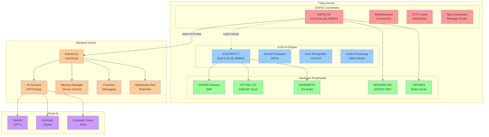
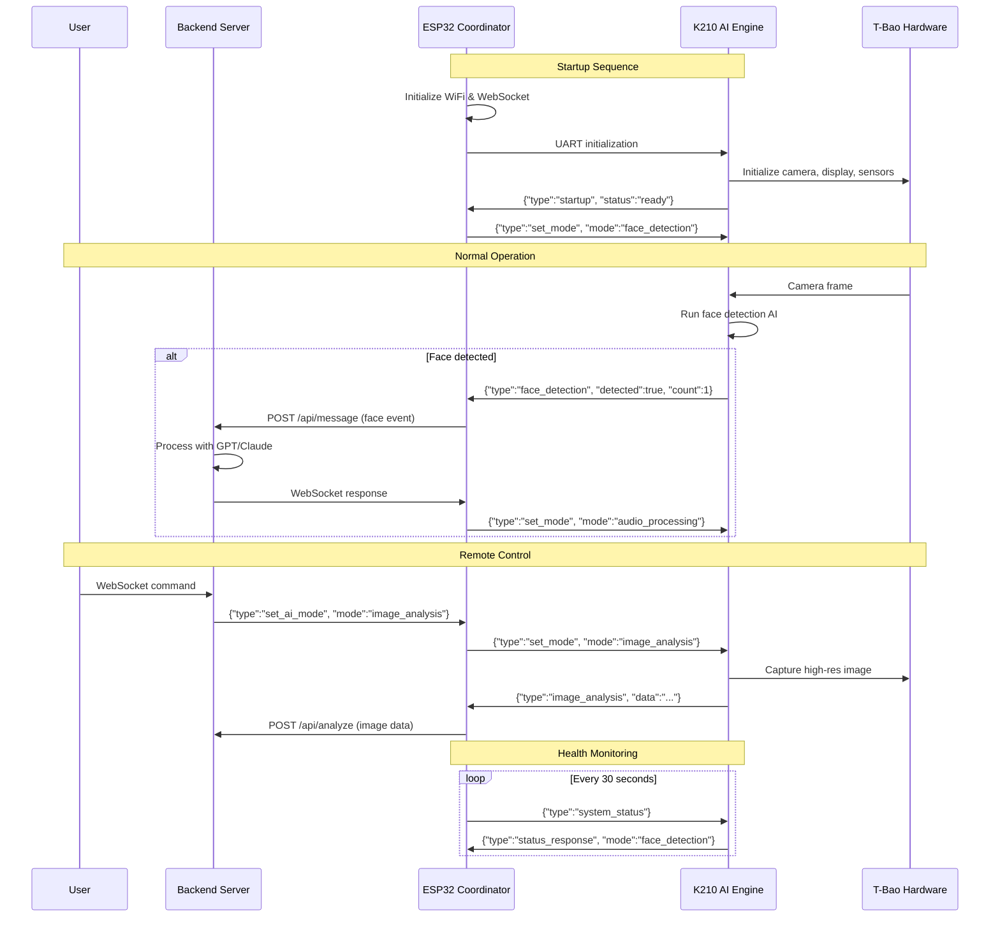
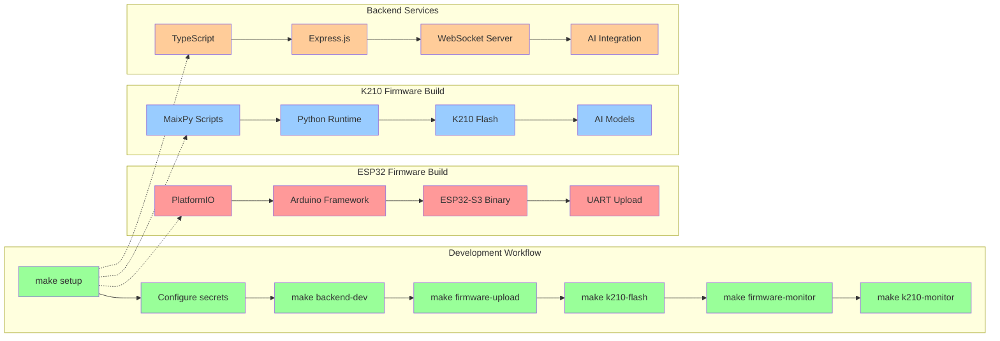

# Development Guide - Hao T-Bao AI Companion

## Architecture Overview

### Complete T-Bao Dual MCU System Architecture



### Legacy System Architecture (ASCII)

```
┌─────────────────────────────────────────────────────────┐
│                    T-Bao Device                          │
│                                                         │
│  ┌─────────────────┐         ┌─────────────────┐        │
│  │     ESP32       │◄────────┤     K210        │        │
│  │   (Connectivity)│  UART   │   (AI Engine)   │        │
│  │                 │   SPI   │                 │        │
│  │ • WiFi/BT       │         │ • Face Recog    │        │
│  │ • WebSocket     │         │ • Audio Proc    │        │
│  │ • HTTP Client   │         │ • Neural Net    │        │
│  │ • Coordination  │         │ • Image Proc    │        │
│  └─────────────────┘         └─────────────────┘        │
│           │                           │                  │
│           │                           │                  │
│  ┌─────────────────┐         ┌─────────────────┐        │
│  │   Peripherals   │         │   AI Hardware   │        │
│  │                 │         │                 │        │
│  │ • LCD Display   │         │ • OV2640 Camera │        │
│  │ • Touch Input   │         │ • Microphone    │        │
│  │ • IMU Sensors   │         │ • Speaker       │        │
│  │ • Motor Control │         │ • KPU/NPU       │        │
│  └─────────────────┘         └─────────────────┘        │
└─────────────────────────────────────────────────────────┘
                        │
                        │ WiFi/HTTP/WebSocket
                        ▼
            ┌─────────────────────────┐
            │     Backend Server      │
            │                         │
            │ • AI Services (GPT/Claude)
            │ • Memory Management     │
            │ • WebSocket Hub         │
            │ • Image Analysis        │
            └─────────────────────────┘
```

### Communication Flow



### Communication Protocol Summary

1. **ESP32 ↔ K210**: JSON over UART (115200 baud)
   - Commands: `set_mode`, `capture_image`, `start_audio`, `system_status`
   - Responses: `startup`, `face_detection`, `image_analysis`, `status_response`

2. **ESP32 ↔ Backend**: HTTP REST + WebSocket
   - HTTP POST: `/api/message`, `/api/analyze`
   - WebSocket: Real-time commands and responses

3. **Backend ↔ Cloud AI**: HTTP API calls
   - OpenAI GPT-4 for natural language processing
   - Anthropic Claude for conversation
   - Computer Vision APIs for image analysis

## Development Workflow

### Development Process Flow



### 1. Environment Setup

```bash
# Install dependencies
make setup
make k210-install-tools

# Configure secrets
copy esp32_firmware\include\secrets_example.h esp32_firmware\include\secrets.h
copy backend\.env.example backend\.env
```

### 2. Development Cycle

```bash
# Terminal 1: Start backend with hot reload
make backend-dev

# Terminal 2: Build and upload firmware, then monitor
make firmware-upload-monitor

# Or use the combined development command
make dev
```

### 3. Testing Workflow

```bash
# Test backend API
make test-api

# Build firmware without uploading
make firmware-build

# Run all tests
make test
```

## Project Structure Deep Dive

### Backend (`/backend`)

```
backend/
├── src/
│   ├── index.ts              # Express server setup, WebSocket, and routes
│   ├── routes/
│   │   └── index.ts          # API route definitions
│   ├── services/
│   │   └── aiService.ts      # AI integration (OpenAI, Anthropic, etc.)
│   ├── memory/
│   │   └── memory.ts         # Per-device memory management
│   └── util/
│       └── scheduler.ts      # Proactive messaging scheduler
├── package.json              # Dependencies and scripts
├── tsconfig.json            # TypeScript configuration
├── .env.example             # Environment template
└── README.md                # Backend-specific documentation
```

#### Key Backend Components

1. **Express Server** (`index.ts`)
   - REST API endpoints for device communication
   - WebSocket server for real-time messaging
   - CORS configuration for cross-origin requests

2. **AI Service** (`aiService.ts`)
   - Abstraction layer for AI providers
   - Text processing and image analysis
   - Configurable model parameters

3. **Memory Manager** (`memory.ts`)
   - Per-device conversation history
   - Context retention and retrieval
   - Memory cleanup and optimization

4. **Scheduler** (`scheduler.ts`)
   - Proactive messaging system
   - Morning routines and check-ins
   - Configurable timing and frequency

### Firmware (`/esp32_firmware`)

```
esp32_firmware/
├── src/
│   └── main.cpp             # Main ESP32 firmware code
├── include/
│   ├── secrets_example.h    # Template for WiFi/backend credentials
│   └── secrets.h           # Actual credentials (git-ignored)
├── platformio.ini          # PlatformIO configuration
└── lib/                    # External libraries (auto-generated)
```

#### Key Firmware Components

1. **WiFi Management**
   - Connection establishment and monitoring
   - Automatic reconnection handling
   - Network status reporting

2. **HTTP Client**
   - REST API communication with backend
   - JSON payload formatting
   - Error handling and retries

3. **WebSocket Client**
   - Real-time message receiving
   - Connection management
   - Automatic reconnection

4. **Hardware Interfaces** (Future)
   - Camera integration (OV2640)
   - Display control (ST7789)
   - Audio processing (MAX98357A)
   - Sensor reading (MPU6050)

## API Documentation

### REST Endpoints

#### POST `/api/message`
Send text message from device to AI.

**Request:**
```json
{
  "deviceId": "dev-001",
  "text": "Hello, how are you?"
}
```

**Response:**
```json
{
  "response": "I'm doing well, thank you for asking!",
  "timestamp": "2024-01-15T10:30:00Z"
}
```

#### POST `/api/analyze`
Send image for AI analysis.

**Request:**
- Content-Type: `multipart/form-data`
- Fields: `deviceId`, `image` (file)

**Response:**
```json
{
  "analysis": "I can see a person in the image...",
  "objects": ["person", "table", "book"],
  "timestamp": "2024-01-15T10:30:00Z"
}
```

#### GET `/health`
Health check endpoint.

**Response:**
```json
{
  "status": "ok",
  "timestamp": "2024-01-15T10:30:00Z",
  "version": "0.1.0"
}
```

### WebSocket

#### Connection
```
ws://localhost:3000/ws/subscribe?deviceId=<device_id>
```

#### Message Format
```json
{
  "type": "proactive",
  "message": "Good morning! How are you feeling today?",
  "timestamp": "2024-01-15T08:00:00Z"
}
```

## Hardware Integration Guide

### T-Bao Hardware Pinout

| Component | Pin/Interface | Description |
|-----------|---------------|-------------|
| Camera (OV2640) | I2C/SPI | 2MP camera with face recognition |
| Display (ST7789) | SPI | 1.54" IPS LCD 240x240 |
| Audio (MAX98357A) | I2S | Digital audio amplifier |
| IMU (MPU6050) | I2C | 6-axis accelerometer/gyroscope |
| PMU (AXP202) | I2C | Power management unit |
| Motors | PWM | DRV8833 motor driver |

### Adding Hardware Support

1. **Camera Integration**
   ```cpp
   // In main.cpp
   #include "esp_camera.h"
   
   // Initialize camera
   camera_config_t config = {
     .pin_pwdn = -1,
     .pin_reset = -1,
     // ... other pins
   };
   esp_camera_init(&config);
   ```

2. **Display Control**
   ```cpp
   // Add display library
   #include <TFT_eSPI.h>
   
   TFT_eSPI tft = TFT_eSPI();
   tft.init();
   tft.setRotation(0);
   ```

3. **Audio Processing**
   ```cpp
   // Add I2S audio
   #include "driver/i2s.h"
   
   i2s_config_t i2s_config = {
     .mode = I2S_MODE_MASTER | I2S_MODE_TX,
     .sample_rate = 44100,
     // ... other config
   };
   ```

## Development Best Practices

### Code Style

1. **Backend (TypeScript)**
   - Use explicit types
   - Implement proper error handling
   - Follow REST API conventions
   - Use async/await for promises

2. **Firmware (C++)**
   - Use meaningful variable names
   - Implement proper error checking
   - Use non-blocking code where possible
   - Add debug logging

### Error Handling

1. **Network Errors**
   - Implement exponential backoff
   - Use circuit breaker patterns
   - Log error details for debugging

2. **Hardware Errors**
   - Check return values
   - Implement fallback behavior
   - Use watchdog timers

### Performance Optimization

1. **Backend**
   - Use connection pooling
   - Implement caching strategies
   - Optimize database queries
   - Use compression for WebSocket

2. **Firmware**
   - Minimize memory allocation
   - Use hardware timers efficiently
   - Implement sleep modes
   - Optimize network usage

### Security Considerations

1. **Authentication**
   - Use device-specific tokens
   - Implement rate limiting
   - Validate all inputs

2. **Network Security**
   - Use HTTPS in production
   - Implement certificate validation
   - Secure WebSocket connections

## Debugging Guide

### Backend Debugging

1. **Logging**
   ```bash
   # Enable debug logging
   export LOG_LEVEL=debug
   make backend-dev
   ```

2. **API Testing**
   ```bash
   # Test endpoints
   make test-api
   
   # Manual curl testing
   curl -X POST http://localhost:3000/api/message \
     -H 'Content-Type: application/json' \
     -d '{"deviceId":"debug","text":"test"}'
   ```

### Firmware Debugging

1. **Serial Monitor**
   ```bash
   # Monitor serial output
   make firmware-monitor
   ```

2. **Debug Prints**
   ```cpp
   // Add debug prints
   Serial.printf("Debug: %s\n", message);
   Serial.println("Checkpoint reached");
   ```

3. **Network Debugging**
   ```cpp
   // Check WiFi status
   if (WiFi.status() != WL_CONNECTED) {
     Serial.println("WiFi disconnected");
     connectWifi();
   }
   ```

## Deployment Strategies

### Development Deployment
```bash
make dev  # Full development environment
```

### Production Deployment
```bash
make deploy  # Build and deploy production version
```

### Docker Deployment (Future)
```bash
make docker-build  # Build Docker image
make docker-run    # Run in container
```

## Troubleshooting

### Common Issues

1. **WiFi Connection Failed**
   - Check credentials in `secrets.h`
   - Verify WiFi network availability
   - Check for special characters in password

2. **Backend Connection Failed**
   - Verify backend is running (`make status`)
   - Check firewall settings
   - Confirm correct host/port in secrets

3. **Upload Failed**
   - Check USB cable connection
   - Verify correct board selection
   - Try different USB port

4. **Memory Issues**
   - Monitor memory usage in logs
   - Implement memory cleanup
   - Use static allocation where possible

### Performance Issues

1. **Slow Response Times**
   - Check network latency
   - Optimize AI service calls
   - Implement caching

2. **High Memory Usage**
   - Profile memory allocation
   - Implement garbage collection
   - Use memory pools

## Contributing

### Development Workflow

1. Fork the repository
2. Create a feature branch
3. Make changes following coding standards
4. Test thoroughly using `make test`
5. Submit pull request with detailed description

### Code Review Checklist

- [ ] Code follows style guidelines
- [ ] All tests pass
- [ ] Documentation updated
- [ ] Error handling implemented
- [ ] Performance impact considered
- [ ] Security implications reviewed

---

**Happy coding with your T-Bao AI companion! 🤖**
