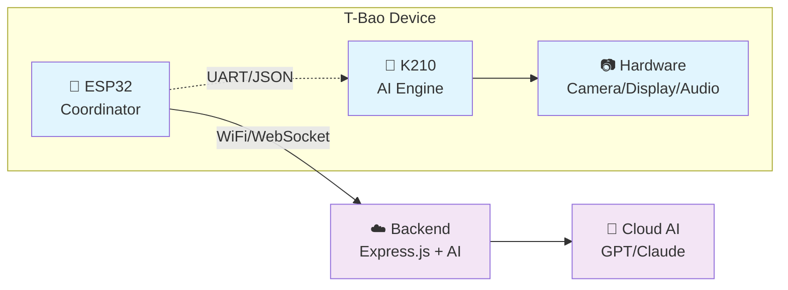

# Hao - T-Bao AI Companion Bot

An intelligent companion bot built for the [LILYGO T-Bao](https://lilygo.cc/products/t-bao) development board, featuring dual-core ESP32 + K210 processing power with camera, display, and AI capabilities.


### 🏗️ System Architecture Overview



## 🚀 Project Overview

This project creates an AI-powered companion that can:
- **See**: 2MP camera with face recognition (QVGA@60FPS / VGA@30FPS)
- **Think**: Dual-core processing (ESP32 + K210 RISC-V)
- **Communicate**: WiFi/Bluetooth connectivity with backend AI services
- **Display**: 1.54" IPS capacitive touch LCD (240x240)
- **Move**: Built-in motor drive capabilities
- **Listen/Speak**: I2S audio amplifier support

## 🛠 Hardware Specifications

### T-Bao Board Features
- **MCU1**: ESP32-D0WDQ6-V3 Xtensa LX6 Dual Core @ 240MHz
- **MCU2**: K210 RISC-V Dual Core 64-bit with FPU
- **Memory**: 16MB Flash + 8MB PSRAM
- **Camera**: OV2640 2MP with face recognition
- **Display**: 1.54" IPS LCD 240x240 (ST7789 driver)
- **Audio**: MAX98357A I2S amplifier (3.2W @ 4Ω)
- **Sensors**: 6-axis MPU6050 + AXP202 PMU
- **Connectivity**: Wi-Fi 802.11 b/g/n + Bluetooth V4.2 + BLE
- **Power**: USB 5V 500mA charging
- **Size**: 53 × 64 × 78mm

## 📁 Project Structure

```
hao/
├── backend/                 # Express.js + TypeScript server
│   ├── src/
│   │   ├── index.ts        # Main server entry point
│   │   ├── services/       # AI services and integrations
│   │   ├── routes/         # API endpoints
│   │   ├── memory/         # Device memory management
│   │   └── util/           # Utilities and schedulers
│   ├── package.json
│   └── README.md
├── esp32_firmware/         # PlatformIO ESP32 firmware (Coordinator)
│   ├── src/main.cpp       # ESP32 coordination and networking
│   ├── include/           # Headers and secrets
│   └── platformio.ini     # Build configuration
├── k210_firmware/          # MaixPy K210 AI firmware (AI Engine)
│   ├── main.py            # K210 AI processing main loop
│   ├── boot.py            # K210 hardware initialization
│   ├── config.py          # Configuration settings
│   └── models/            # AI model files (.kmodel)
├── examples/               # Reference makefiles and configs
├── Makefile               # Build and deployment commands
├── DEVELOPMENT.md         # Development guide and architecture
└── README.md              # This file
```

## 🚀 Quick Start

### Prerequisites
- Node.js 18+ and npm
- [PlatformIO](https://platformio.org/) for ESP32 development
- Python 3.7+ with pip (for K210 tools)
- T-Bao development board
- Make utility (Windows compatible)

### 1. Setup Everything
```bash
make setup
make k210-install-tools  # Install K210 development tools
```

### 2. Configure Secrets
```bash
# Copy and edit WiFi/backend credentials
copy esp32_firmware\include\secrets_example.h esp32_firmware\include\secrets.h
# Edit secrets.h with your WiFi and backend details

# Copy and edit backend environment
copy backend\.env.example backend\.env
# Edit .env with your API keys and configuration
```

### 3. Dual MCU Development Workflow
```bash
# Start backend development server
make backend-dev

# In another terminal, deploy ESP32 coordinator firmware
make firmware-upload

# Flash K210 AI engine (put T-Bao in K210 flash mode first)
make k210-flash

# Monitor both MCUs
make firmware-monitor    # ESP32 coordinator
make k210-monitor       # K210 AI engine

# Full dual-MCU deployment
make deploy-full
```

## 🔧 Available Commands

Run `make help` to see all available commands:

### Backend Commands
- `make backend-install` - Install backend dependencies
- `make backend-dev` - Start development server with hot reload
- `make backend-build` - Build production backend
- `make backend-start` - Start production backend
- `make backend-test` - Run backend tests

### Firmware Commands
- `make firmware-build` - Build ESP32 firmware
- `make firmware-upload` - Upload firmware to T-Bao
- `make firmware-monitor` - Monitor serial output
- `make firmware-clean` - Clean build artifacts

### Development Commands
- `make setup` - Initial project setup
- `make clean` - Clean all build artifacts
- `make deploy` - Full build and deployment
- `make status` - Show project status

## 🧠 AI Features

The companion bot includes:

### Backend AI Services
- **Message Processing**: Natural language understanding and response generation
- **Image Analysis**: Computer vision capabilities for camera input
- **Memory Management**: Per-device conversation history and context
- **Proactive Messaging**: Scheduled check-ins and routine reminders
- **WebSocket Communication**: Real-time bidirectional communication

### Hardware AI Capabilities
- **Face Recognition**: K210-powered face detection and recognition
- **Audio Processing**: Voice input/output capabilities
- **Sensor Fusion**: IMU data for context awareness
- **Edge Processing**: Local AI inference on K210 chip

## 🔌 API Endpoints

### REST API
- `POST /api/message` - Send text message to AI
- `POST /api/analyze` - Send image for AI analysis
- `GET /health` - Health check

### WebSocket
- `ws://localhost:3000/ws/subscribe?deviceId=<id>` - Real-time messaging

### Example Usage
```bash
# Send text message
curl -X POST http://localhost:3000/api/message \
  -H 'Content-Type: application/json' \
  -d '{"deviceId":"dev-001","text":"Hello Hao!"}'

# Test WebSocket in browser console
const ws = new WebSocket('ws://localhost:3000/ws/subscribe?deviceId=dev-001');
ws.onmessage = (e) => console.log('Received:', e.data);
```

## 🔧 Development Setup

### Backend Development
The backend runs on Express.js with TypeScript and includes:
- Hot reload development server
- WebSocket support for real-time communication
- Modular service architecture
- Memory management for device contexts
- Scheduled task system

### Firmware Development
The ESP32 firmware uses PlatformIO and includes:
- WiFi connectivity management
- HTTP client for API communication
- WebSocket client for real-time updates
- Serial debugging interface
- Modular hardware abstraction

## 📚 Resources

### Official Documentation
- [T-Bao Product Page](https://lilygo.cc/products/t-bao)
- [Official GitHub Repository](https://github.com/Xinyuan-LilyGO/LilyGo-K210-Script)
- [LILYGO Documentation](https://github.com/Xinyuan-LilyGO)

### Development Resources
- [PlatformIO ESP32 Guide](https://docs.platformio.org/en/latest/platforms/espressif32.html)
- [ESP32 Documentation](https://docs.espressif.com/projects/esp-idf/en/latest/)
- [K210 SDK Documentation](https://github.com/kendryte/kendryte-standalone-sdk)

## 🚧 Roadmap

### Current Features
- ✅ Basic WiFi connectivity
- ✅ Backend API communication
- ✅ WebSocket real-time messaging
- ✅ Device memory management
- ✅ Scheduled messaging system

### Planned Features
- 🔄 Camera integration and image processing
- 🔄 LCD display interface
- 🔄 Audio input/output
- 🔄 Face recognition implementation
- 🔄 Voice command processing
- 🔄 Motor control for physical interaction
- 🔄 Advanced AI model integration
- 🔄 Mobile app companion

### Future Enhancements
- 📋 Cloud AI service integration
- 📋 Multi-device synchronization
- 📋 Custom personality training
- 📋 IoT device control capabilities
- 📋 Advanced computer vision features

## 🤝 Contributing

1. Fork the repository
2. Create a feature branch (`git checkout -b feature/amazing-feature`)
3. Commit your changes (`git commit -m 'Add amazing feature'`)
4. Push to the branch (`git push origin feature/amazing-feature`)
5. Open a Pull Request

## 📄 License

This project is licensed under the MIT License - see the [LICENSE](LICENSE) file for details.

## 🆘 Support

- 🐛 [Report Issues](https://github.com/your-username/hao/issues)
- 💬 [Discussions](https://github.com/your-username/hao/discussions)
- 📧 [Contact](mailto:your-email@example.com)

---

**Built with ❤️ for the T-Bao AI companion ecosystem**
